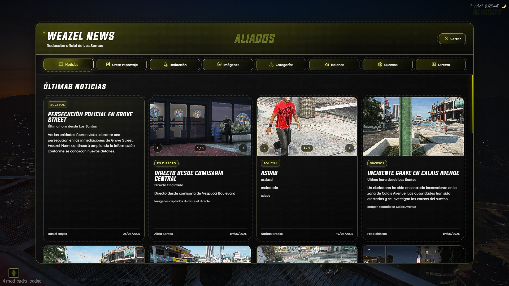
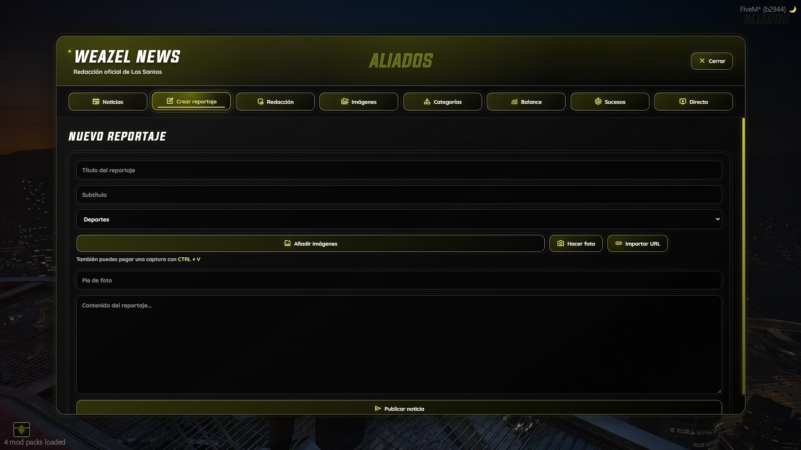
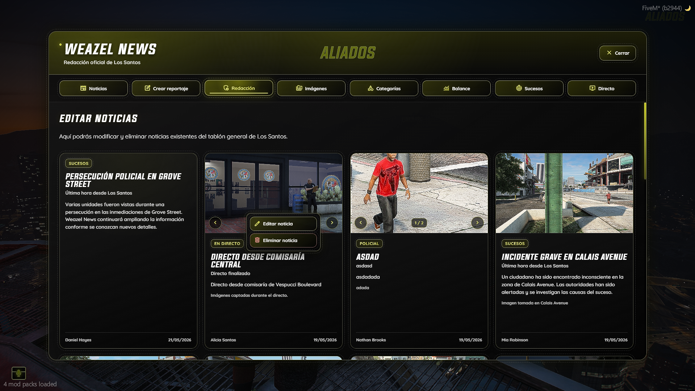
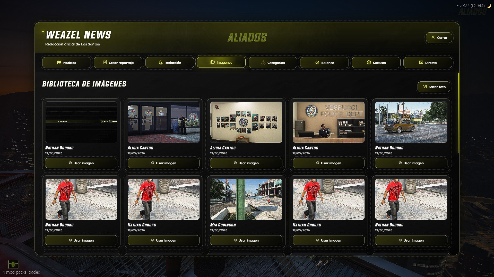
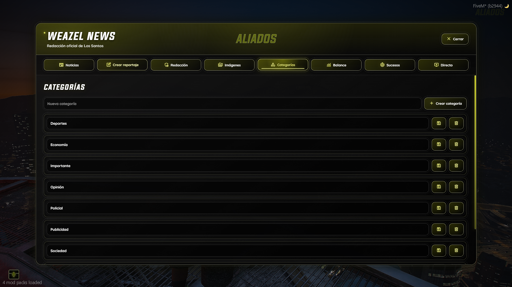
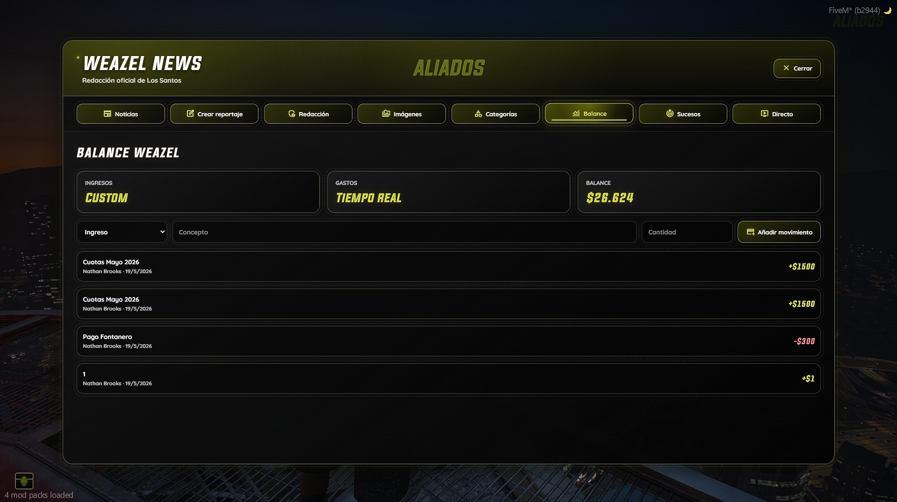
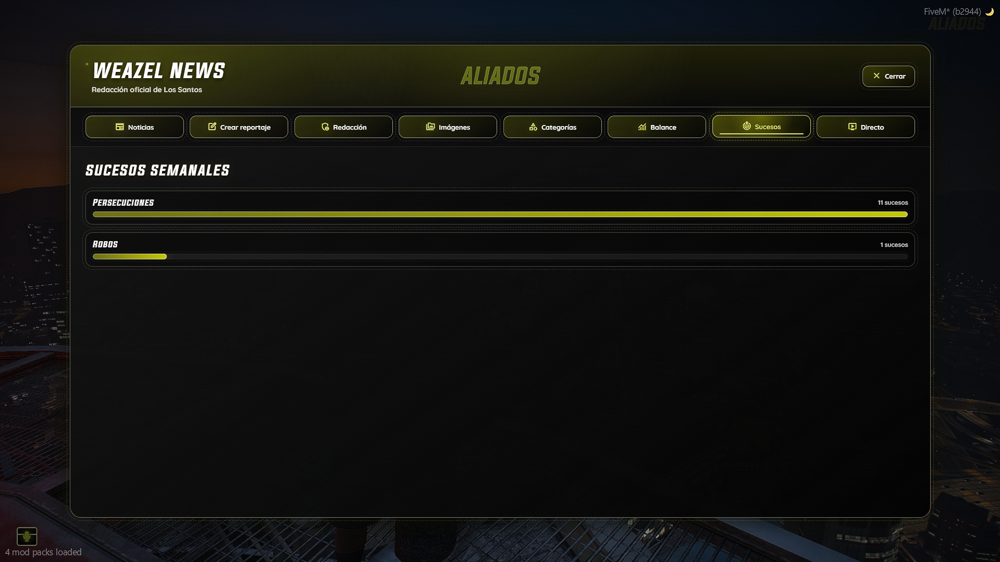
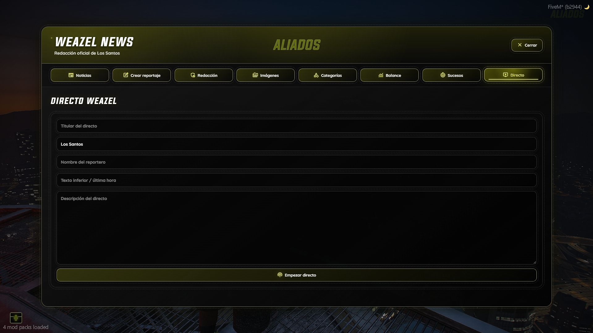
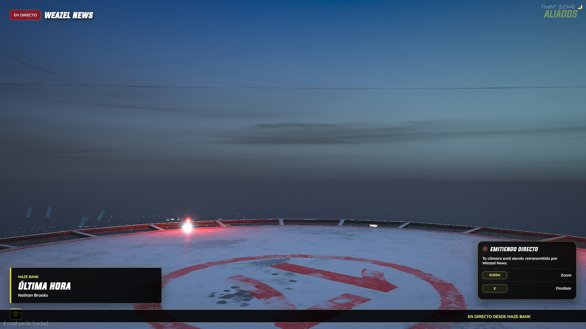

# 📰 aliados_weazel

<div align="center">


**Advanced Weazel News system for GTA V Roleplay**

Immersive journalism, live broadcasts, multimedia management, automatic city events and a premium cinematic UI.

🟡 **Available on Tebex**  
➡️ **Purchase here:** [Aliados Store](https://aliadosrp.tebex.io/)

</div>

---

## ✨ Features

### 📰 News System
- Advanced article creation
- Multiple categories
- Multi-image support
- Interactive image carousel
- Photo captions
- Edit existing articles
- Public news view for citizens

### 📸 Multimedia Library
- Shared image library
- In-game photo system
- First person camera mode
- Zoom controls
- URL image import
- **CTRL + V clipboard support**
- Historical image storage

### 📡 Live Broadcast System
- Live broadcasts
- TV-style overlays
- Reporter camera mode
- Public live viewing
- Automatic post-live article generation
- Automatic thumbnails during broadcasts

### 🤖 Automatic City Events
- Dynamic automatic news
- Event-based reports
- Configurable city events
- Automatic reporters
- Randomized immersive texts

### 💰 Finance Integration
- Real-time balance
- Transaction history
- Custom finance database support
- Compatible with external systems

### 🎨 Premium UI
- Cinematic dark interface
- Aliados premium style
- Immersive experience
- Optimized UX/UI

---

# 📸 Preview

## Dashboard / News

<p align="center">
  
  
</p>

---

## Article Creation

<p align="center">
  
  
</p>

---

## Multimedia Library

<p align="center">
  
  
</p>

---

## Live Broadcast System

<p align="center">
  
  
</p>

---

## Finance / Statistics

<p align="center">
  
</p>

---

# ⚙️ Dependencies

### Required
```txt
qb-core
oxmysql
screenshot-basic
```

### Optional
```txt
FiveManage API
Custom finance systems
```

---

# 🛠️ Installation

1. Download the resource  
2. Place `aliados_weazel` inside your `resources` folder  
3. Import the SQL file  
4. Configure `config.lua`  
5. Install dependencies  
6. Start the resource

```cfg
ensure aliados_weazel
```

---

# 🔧 Configuration

Basic setup:

```lua
Config.Core = 'qb-core'
Config.JobName = 'reporter'
Config.UseTarget = true
Config.TabletCommand = 'weazel'
```

Supports:

- Custom finance systems
- Automatic city events
- Live broadcasts
- Category management
- Shared image libraries
- Multimedia uploads
- Automatic thumbnails
- Reporter permissions

---

# 🛒 Purchase

Want the full premium version?

🟡 **Available on Tebex**  
➡️ **Buy here:** [Aliados Store](https://aliadosrp.tebex.io/)

---

# 📜 License

This resource is protected and intended for authorized use only.

Unauthorized redistribution, leaking or reselling is prohibited.

---

<div align="center">

### Made with ❤️ by **jcarrozadev** for **Aliados**

</div>
